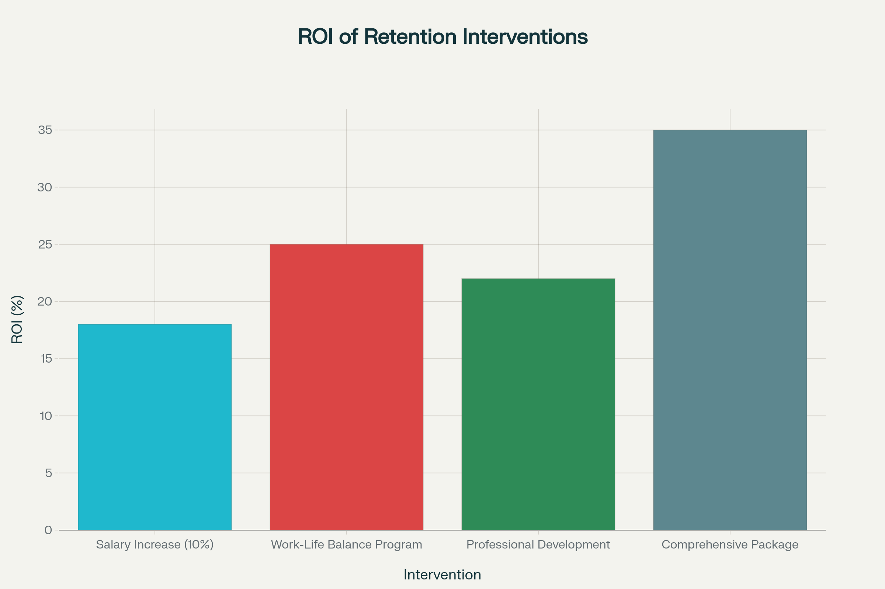

📊 **Attrition Analytics Dashboard**

Interactive dashboards and ML-powered insights to help HR teams predict employee attrition and evaluate retention interventions using the IBM HR dataset.

## 📷 Sample ROI Visualization



## 🚀 What’s Included

This repository contains two main components:

### 1. **Web-Based Dashboard (frontend/)**  
A static, browser-based dashboard that uses HTML, CSS, and JavaScript to visualize attrition insights and simulate retention strategy ROI.
- `index.html` – Main UI
- `style.css` – Custom styling
- `app.js` – Dashboard logic with Chart.js
- `roi_comparison_chart.png` – Pre-generated visualization for documentation

### 2. **Streamlit ML Dashboard (backend/)**  
A Python-powered app using Streamlit to provide real-time attrition prediction and user interaction.
- `attrition_dashboard.py` – Main Streamlit app
- `employee_attrition_predictor.py` – Machine learning logic & model pipeline


## 📂 Repo Structure

```

attrition-analytics/
├── frontend/
│   ├── index.html
│   ├── style.css
│   ├── app.js
│   └── roi\_comparison\_chart.png
├── backend/
│   ├── attrition\_dashboard.py
│   └── employee\_attrition\_predictor.py
├── requirements.txt
├── .gitignore
└── README.md

````


## 🧰 Tech Stack

- **Frontend**: HTML5, CSS3, JavaScript, Chart.js  
- **Backend**: Python, Streamlit, scikit-learn, Pandas, Plotly, NumPy


## 🔧 Setup Instructions

### 1. Install dependencies

```bash
pip install -r requirements.txt
````

### 2. Launch the Streamlit app

```bash
cd backend
streamlit run attrition_dashboard.py
```

### 3. Explore the static dashboard

Simply open `frontend/index.html` in any modern browser to explore filters and ROI visualizations.


## 🎯 Features

* **ML-based attrition prediction** with pipelined preprocessing and model logic
* **Interactive web dashboard** simulating retention interventions (e.g., salary increase, professional development, work‑life balance enhancements)
* **ROI simulation** showcasing impact of various strategies
* **Data visualization** highlighting key risk factors, feature importance, and department-level attrition breakdown


## 📚 Dataset

Based on the IBM HR Analytics dataset (publicly available):
*IBM HR Analytics Employee Attrition & Performance* by Pavan Subhasht at Kaggle


## 📜 License

This project is open source under the **MIT License**. Check the `LICENSE` file for details.


## 👤 Author

**Priti Singh**
